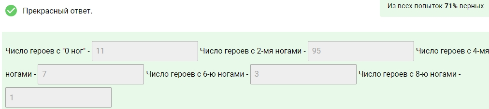

# Введение в Data Science и машинное обучение
Заметки [обучающего курса](https://stepik.org/course/4852/syllabus) платформы Stepik
[Основы статистики](https://stepik.org/course/76/promo)

[Открытые базы данных](https://jivoi.github.io/2015/07/04/otkrytyie-bazy-dannykh-rf/)

[kaggle](https://www.kaggle.com/)

[Сообщество Open Data Science](https://ods.ai/jobs)

[Посещать data fest, как попасть](https://youtu.be/w-0NdY8y-4Y?t=2482)

[X5 Tech, Валерий Бабушкин](https://www.youtube.com/@X5Technology/featured)

## Контакты
[Валерий Бабушкин](https://youtu.be/w-0NdY8y-4Y)

## Словарь изученных методов Pandas
* filter() - отбор по колонок иил строк
* iloc() - выбирает строки и колонки
* loc() - выбор по лейблам
* groupby() - группировка данных
* aggregate() - агригация показателей
* rename() - переименование колонок
* assign() - добавляет новую колонку/и, только им и пользоваться т.к. он работает быстрее всех [подробнее](https://suilin.ru/post/pandas_column/)
* fillna() - заполняет значения NA/NaN указанными значениями
* median() - возвращает медиану значений по указаной оси

## Визуализация
* [matplotlib](https://matplotlib.org/)
* [встроенная в pandas визуализация](https://pandas.pydata.org/pandas-docs/stable/reference/api/pandas.DataFrame.plot.html)
* [seaborn](https://seaborn.pydata.org/)

### Графики
* DataFrame.hist() - гистограмма
* DataFrame.plot.scatter() - точечная диаграмма, корреляция между двумя переменными
* seaborn.kdeplot - график плотности
* seaborn.displot - эта функция обеспечивает доступ к нескольким подходам к визуализации одномерного или двумерного распределения данных. Параметр kind - определяет, что рисуем.
* seaborn.pairplot - отражающий зависимость пар переменных друг от друга, а также распределение каждой из переменных

## Карьера в data science
Тезисы из видео:

1. При построении карьеры в Data Science важно иметь готовые проекты, чтобы на собеседовании направить диалог по удобному для себя руслу, да и просто продемонстрировать свои конкурентные преимущества

2. Датасеты для анализа можно брать с kaggle, открытых источников, или просто собирать при помощи парсеров. причём последний вариант даёт плюс к компетенциям, поскольку вы покажете умение кодить и получать данные для своих моделей

3. Важны soft-skills

4. Важно и нужно уметь отвечать на вопросы не "Сколько?", а "Почему?". Поскольку получение цифр не даёт информации, а анализ этих цифр, анализ причин почему цифры именно такие, и как они сформировались - позволяет представить некоторую картину в процессах.

5. Работайте с API и хакатонами. Поднатаскайтесь в плане работы с проектами, пусть даже через API проекта. Пишите свои проекты и ссылайтесь на них в резюме.

## 1.2 Биг дэйта, дип машин лернинг, основные понятия
[Как попасть в data science](https://www.youtube.com/watch?v=lDkTNURDIaY)

Стадии машинного обучения:
1. Обозначить проблему которую необходимо решить
2. Предобработка данных (извлечение, чистка данных)
3. Применение машинного обучение (регресия, классификация)
4. Валидация модели (удостовериться что модель правильно предсказывает, как понять что есть проблема)

## 1.3 Модель, нет, не супермодель, начнем с дерева
Алгоритмы машинного обучения:
- линейная регрессия
- решающие деревья

Классификация и регрессия

Задача регрессия - предсказание количественной переменной
Задача классификации - предсказание классов (например один из двух возмжных классв, запрещенный и не запрещенный багаж)

Модели машинного обучения:
- дерево решиений
- нейронные сети

## 1.4 Pandas, Dataframes, нет, панды тут ни при чем
Cheat Sheets по Python, Jupyter, NumPy, SciPy, Pandas, Scikit-Learn, Matplotlib, Seaborn и Bokeh.
[Одним pdf файлом](assets/python-cheatsheets.pdf)

[Статья про ML простым языком](https://vas3k.ru/blog/machine_learning/)
### Pandas
Основные способы выборки данных:
* iloc - выбирает строки и колонки
* loc - выбор по лейблам

[разница между pandas loc и iloc](https://stackoverflow.com/questions/31593201/pandas-iloc-vs-ix-vs-loc-explanation)

Как отобрать все строки кроме указанных [док-ция](https://pandas.pydata.org/pandas-docs/stable/generated/pandas.DataFrame.drop.html) ответ на [stackoverflow](https://stackoverflow.com/questions/31593201/how-are-iloc-and-loc-different)

[Пример](assets/1_4_lesson.ipynb)

table_random['gender'] - вернет тип series

table_random[['gender']] - вернет тип dataframe

Сопоставьте значения из двух списков

## 1.5 Фильтрация данных
query - отбор данных

отбор по двум условиям

    data[(data['writing score'] > 74) & (data.gender == 'female')]
При работе с pandas series для логического И нужно использовать & вместо уже знакомого and. Нужно указать приоритет операций, взяв условия в скобки [(condition) и (condition)]

[notebook примеры урока](https://github.com/onword333/stepik-intro-to-ds-and-ml/blob/main/assets/1_5_lesson.ipynb)

[Как различается среднее и дисперсия оценок по предметам у групп студентов со стандартным или урезанным ланчем ?](assets/1_5_lesson.ipynb)

Сопоставьте значения

### Отбор колонок, метод filter
filter - отбирает колонки по названию колонок или по строкам

    DataFrame.filter(items=None, like=None, regex=None, axis=None)

### Шаг 12
Отберите колонки, в которых есть '-' в датафрэйме df (вот соответствующий датасэт). Сохраните их в переменную selected_columns
    
    selected_columns = df.filter(like = '-')

## 1.6 Группировка и агрегация
groupby - группировка данных см. [пример](assets/1_6_lesson.ipynb)

Сгруппируйте героев из датасэта (dota_hero_stats.csv) по числу их ног (колонка legs), и заполните их число в задании ниже:

К нам поступили данные из бухгалтерии о заработках Лупы и Пупы за разные задачи! Посмотрите у кого из них больше средний заработок в различных категориях (колонка Type) и заполните таблицу, указывая исполнителя с большим заработком в каждой из категорий: